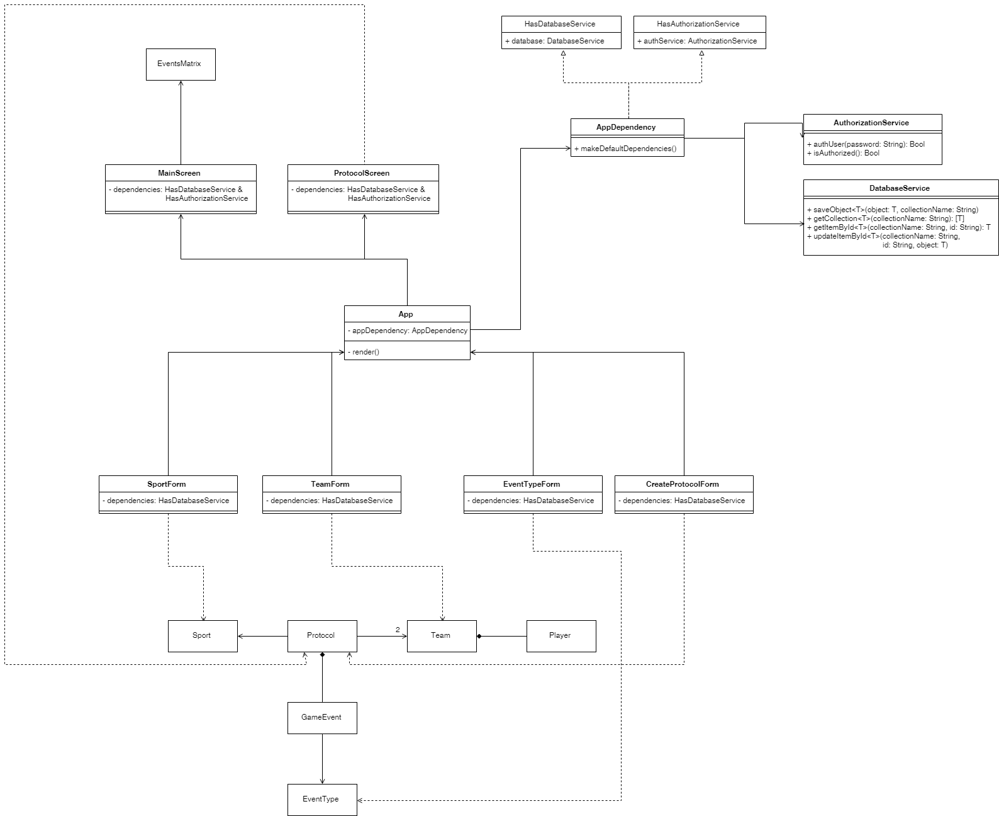

# Спортивные протоколы
Рабочая версия доступна [здесь](https://denrah.github.io)

Пароль для входа - **admin**

Приложение написано на TypeScript + React

Для запуска локально:

    npm install
    npm start

## Диаграмма классов

## Пара комментариев 

Приложение в качестве хранилища данных использует LocalStorage. Для него была реализована своя обертка DatabaseService, которая предоставляет набор generic-методов для работы с хранилищем.

Внедрение зависимостей в отдельные классы-компоненты происходит при помощи алиасов типов. Всего в приложении есть две зависимости - DatabaseService и AuthorizationService. Все они инициализируются в специальном классе AppDependency, который отвечает за управление этими зависимостями. Он одновременно реализует интерфейсы HasDatabaseService и HasAuthorizationService, которые компоненты требуют в зависимости от нужных им сервисов.

## Известные проблемы
В приложении пользователю не показывается результат валидации. Так что если вы нажимаете на кнопку "Сохранить", а форма не реагирует, значит какие-то поля заполнены не правильно.

Разумеется, некоторые вещи можно было бы сделать лучше. Например, названия коллекций в хранилище вынести в константы приложения. Но это и остальное не было сделано в силу ограниченного времени.
